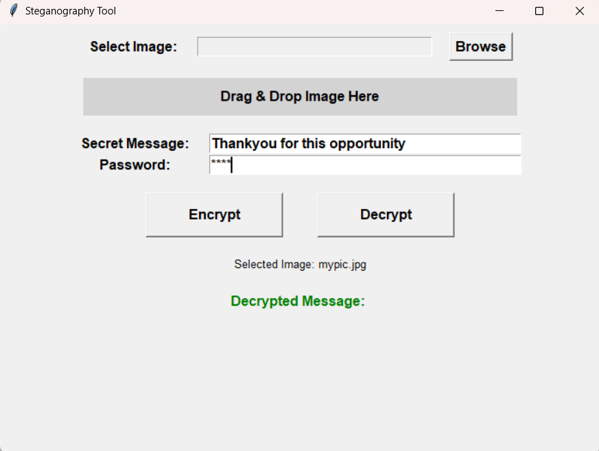
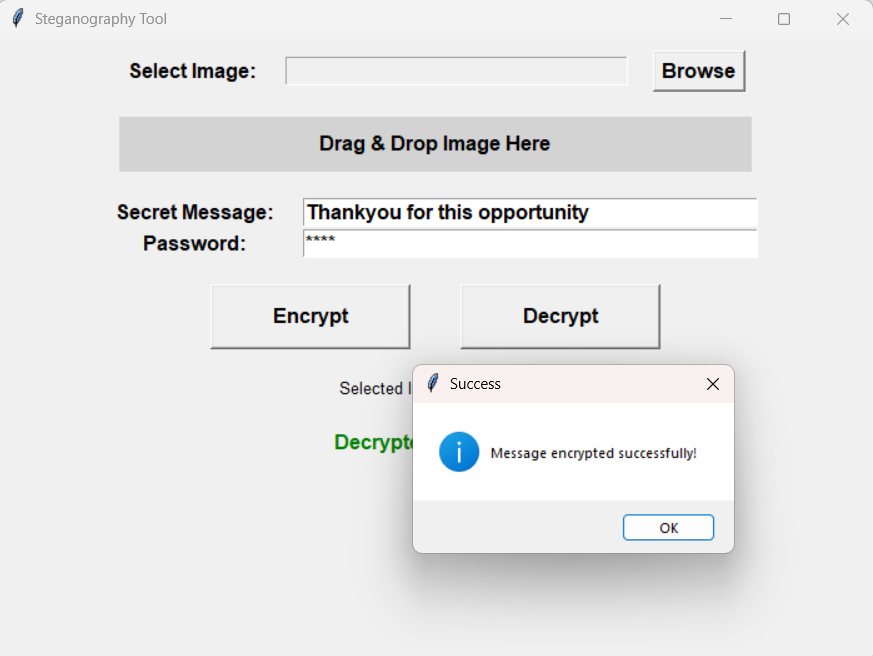
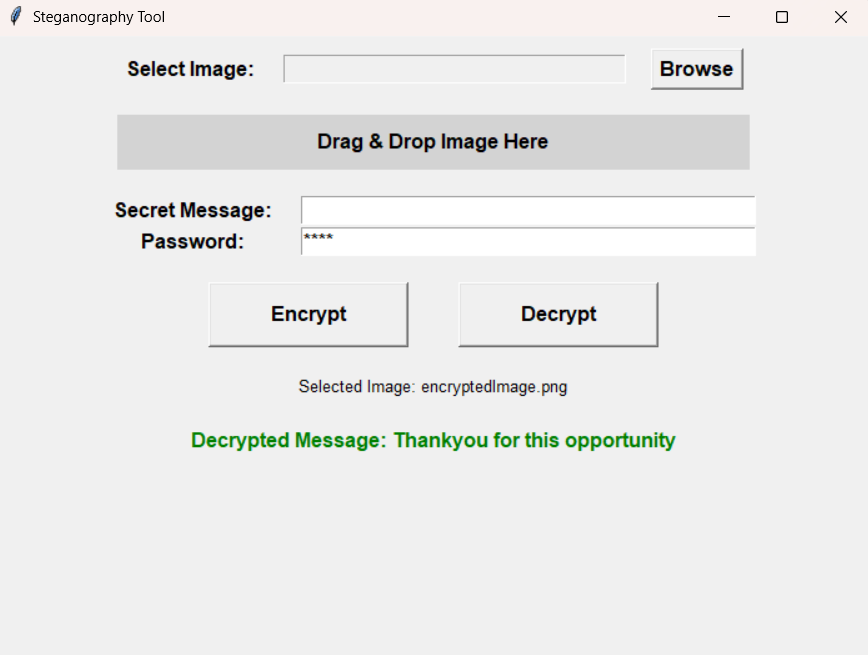

# Steganography Project
*SECURE DATA HIDING IN IMAGES USING STEGANOGRAPHY*

Project Description

This steganography project hides secret messages within images, ensuring secure and undetectable communication. It features password-protected encryption, minimal image distortion, and drag-and-drop functionality for ease of use. The system provides a covert and efficient method for transmitting sensitive data while maintaining image integrity.

Features

Message Hiding in Images – Embeds secret text within images for secure communication.
Password-Protected Encryption – Ensures only authorized users can decrypt the hidden message.
Minimal Image Distortion – Maintains the original quality of the image while embedding data.
Drag & Drop Functionality – Allows easy selection of images for encoding and decoding.
User-Friendly GUI – Simplifies the process of hiding and retrieving messages.
Supports Various Image Formats – Works with multiple image types like JPG and PNG.

Screenshots

Technologies Used

*Python

*OpenCV

*Tkinter

*TkinterDnD2

Connect with Me

[LinkedIn](https://www.linkedin.com/in/patilsuruchi/)
